# Montes de África visibles desde el piso de Guille en la Malagueta

- Las imágenes tomadas desde la terraza del octavo piso son
  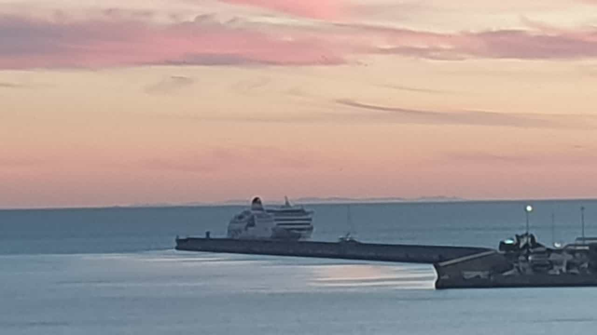
  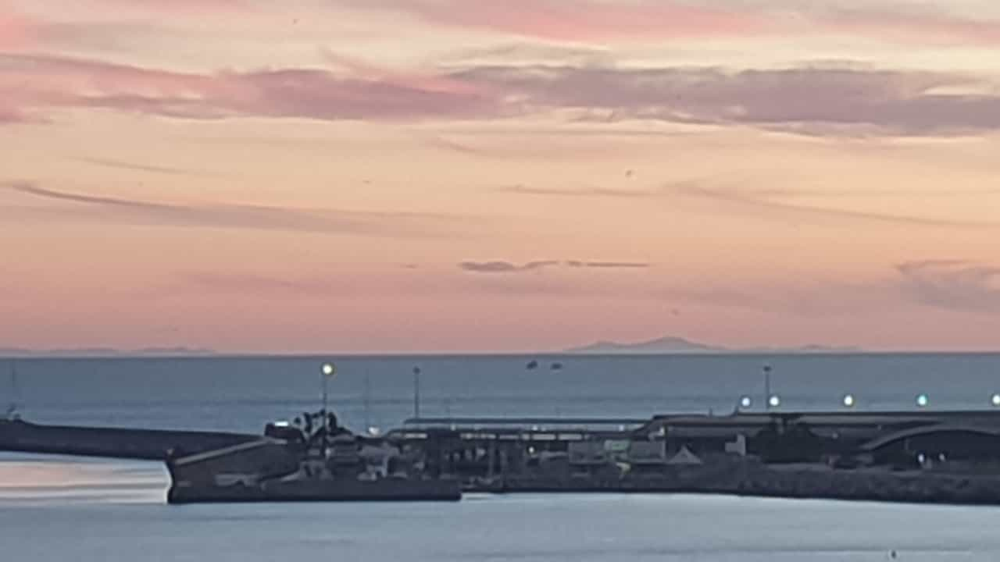
- Estas imágenes coinciden con otras publicadas en Internet. En una página web personal   [https://www.ac.uma.es/~felipe/africa/](https://www.ac.uma.es/~felipe/africa/) del profesor Luis Felipe Romero (licenciado en Ciencias Físicas que imparte clases de computación en la UMA) se encuentra una fotografía similar realizada desde El Palo a 55 metros sobre el nivel del mar.
  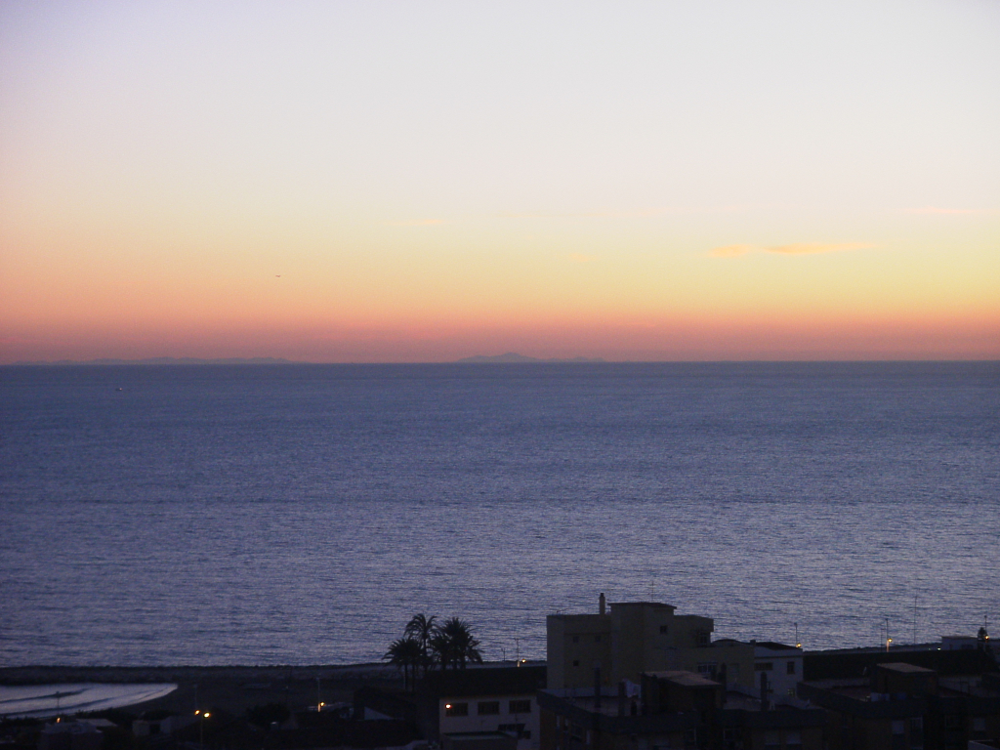
  
  Cuando se comparan la similitud es obvia
  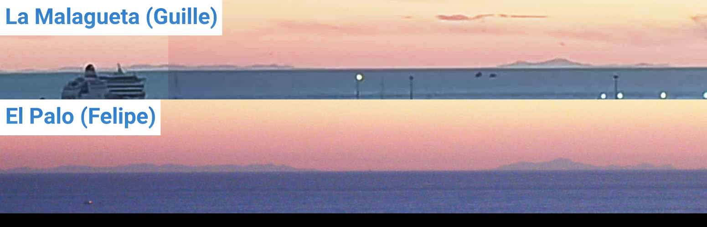
  
- Mediante la aplicación web [https://www.udeuschle.de/panoramas/makepanoramas_en.htm](https://www.udeuschle.de/panoramas/makepanoramas_en.htm) se puede obtener una imagen panorámica generada por ordenador que muestra los nombres de las montañas visibles. Para usarla hace falta conocer la posición y altura sobre el nivel del mar (también llamada _cota_) desde la que se observa el horizonte. Se estima que el piso de la octava planta se encuentra a unos 45 metros sobre el nivel del mar (24 metros de ocho plantas más 10 metros hasta el patio más 10 metros de altura del patio sobre el nivel del mar; ver el cálculo de la estimación más adelante). Habría que considerar también el valor de la refracción (lo que es difícil porque depende de parámetros como la presión y la temperatura y, por lo tanto, varía según el día y la hora). Esta aplicación no permite modificarlo pero al menos sí  tiene en cuenta la refracción presuponiendo que el índice vale 0.13 (éste es uno de los valores usados en topografía cuando se desconoce el índice de refracción real).

  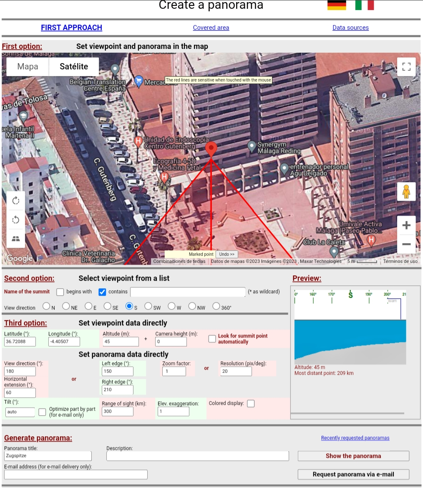

  Se comprueba que la simulación coincide bastante con las fotografías reales.
  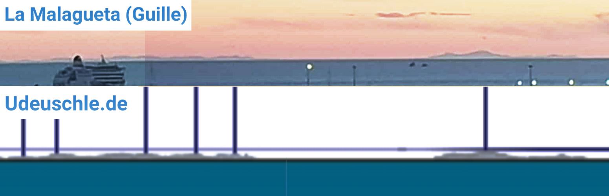

- La montaña que se divisa mejor es Jebel Kelti que tiene 1923 metros de altura y se encuentra a 175 km de distancia.
  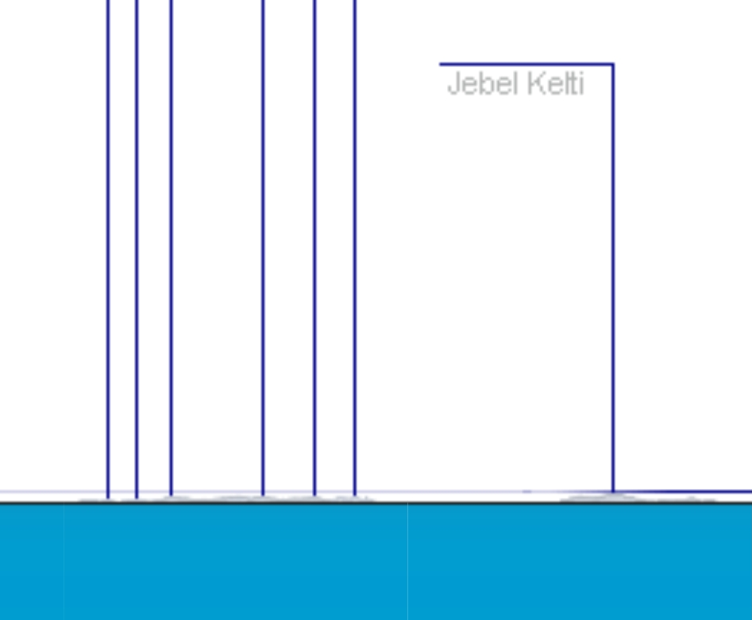
  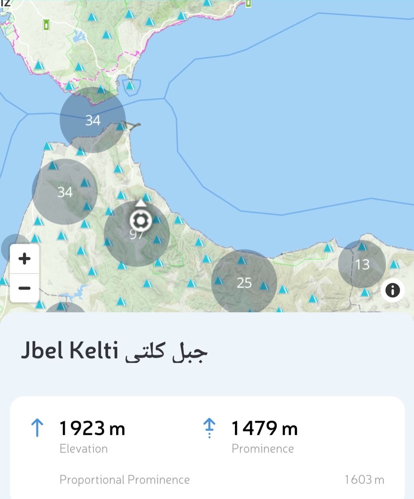

- Mediante la aplicación web _HeyWhatsThat Path Profiler_ en [https://www.heywhatsthat.com/profiler.html](https://www.heywhatsthat.com/profiler.html) se puede obtener una sección vertical junto con la trayectoria que siguen los rayos de luz. Indicando un índice de refracción de 0.13 la aplicación muestra que se pueden observar los últimos 500 metros hasta la cima de la montaña Kelti (si se establece el índice a 0 solo mostraría unos 200 metros).

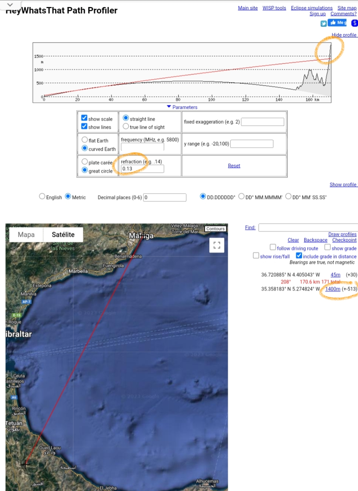

## Cota del octavo piso

- Se estima que la ventana del octavo piso está a unos 45 metros sobre el nivel del mar. El terreno original parte desde 10 metros de altura en la esquina del patio (calle Gutemberg con Paseo Marítimo Pablo Ruiz Picasso) hasta 15 metros en el edificio (terminando en 20 metros de cota en Paseo de Sancha). Adjunto capturas de pantalla de la página [https://es-es.topographic-map.com](https://es-es.topographic-map.com) y de la app _My Elevation_.
  - Suponiendo que allanaron el terreno a la cota más baja, el patio está situado 10 metros sobre el nivel del mar.
  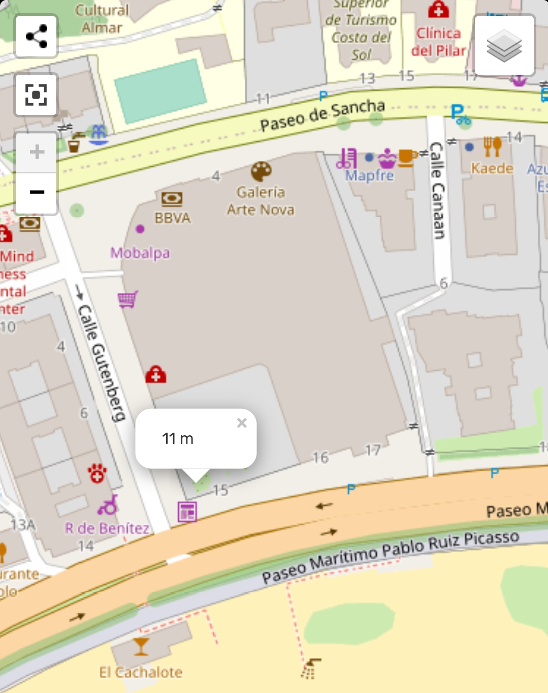
  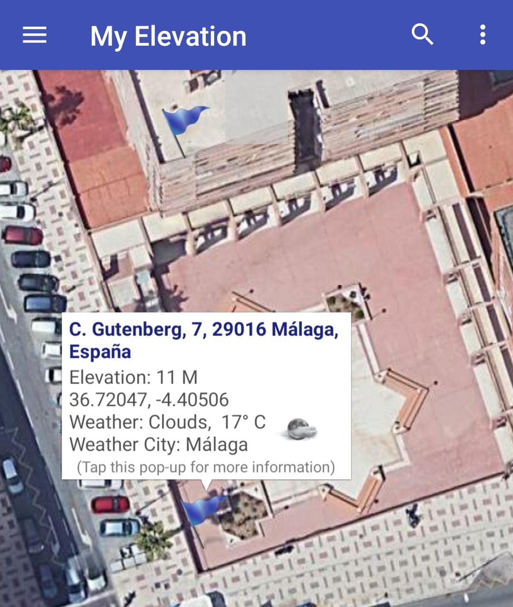
  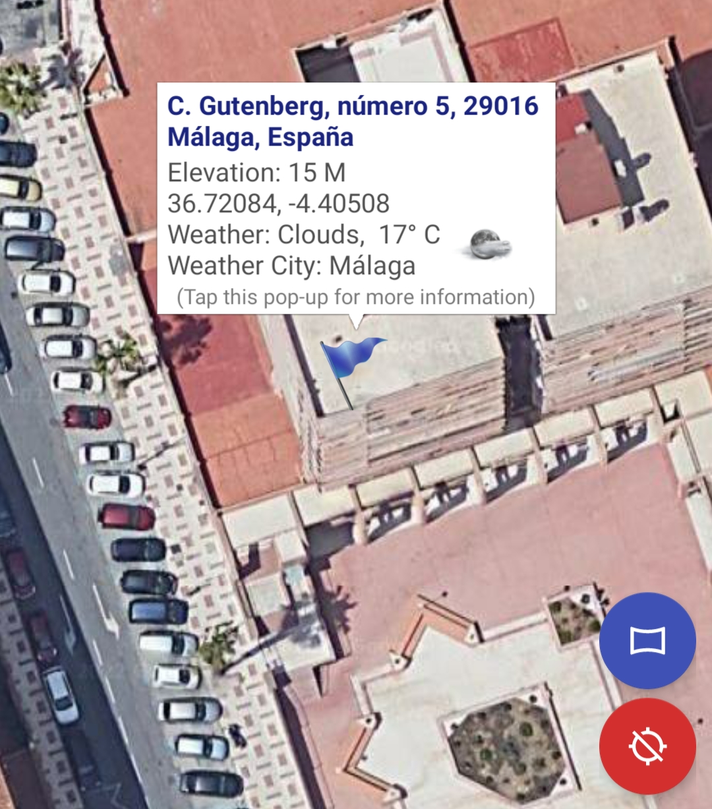
  - Las ocho plantas a 3 metros por planta son 24 metros.
  - Finalmente, la altura entre el hueco inferior al primer piso y el patio no parece ser inferior a 10 metros según imagen de Street View.
  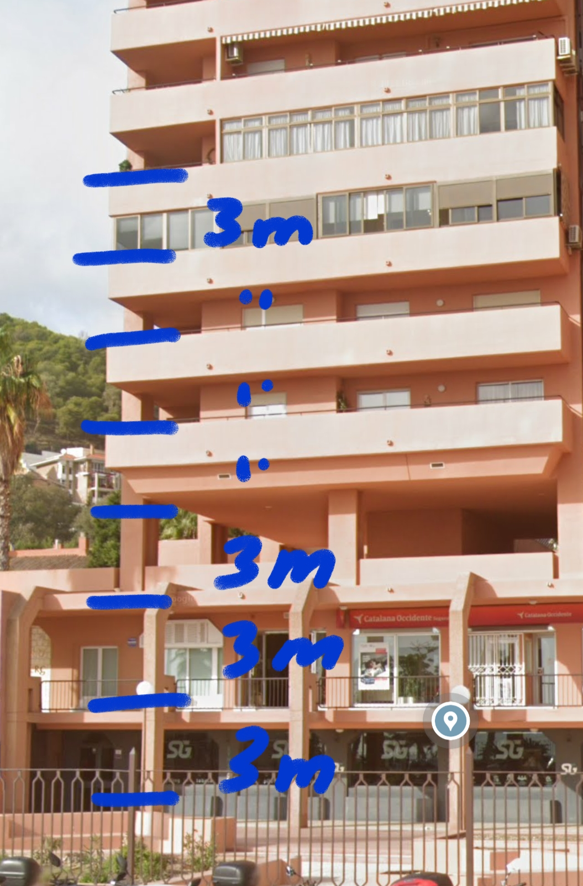
  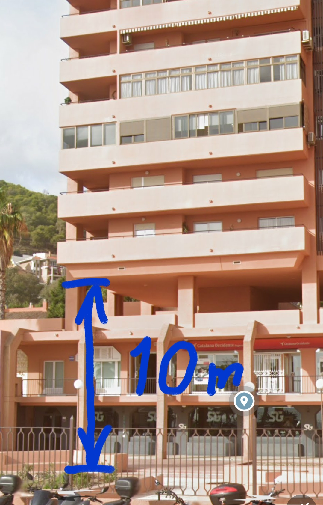
  
## Cálculos sin tener en cuenta la refracción

- La distancia al horizonte desde una altura de 45 metros es 3.57 x raiz(45) = 24 km.
- La distancia máxima a la que podría divisarse la cima del monte Kelti (1923 metros de cota) desde una altura de 45 metros sobre el nivel del mar es 3.57 x raiz(1920) + 3.57 x raiz(45) = 180 km.
- La altura mínima de la montaña Kelti situada a 175 kilómetros que se puede divisar desde 45 metros de altura es (175/3.57 - raiz(45))^2 = 1790 m.

  Pero esto significa que solo se verían 1923 - 1790 = 133 m. El mínimo ángulo que un ojo con agudeza visual 6/6 puede percibir es un minuto, esto es, un grado dividido entre 60. Un arco de un minuto sobre el horizonte cubre una altura de 51 metros. Por lo tanto, según estos cálculos la parte visible del monte Kelti solo abarcaría 3 minutos de arco, apenas apreciable en el horizonte. Pero gracias a la refracción se pueden divisar más de 500 metros de montaña, unos 10 minutos de ángulo.
